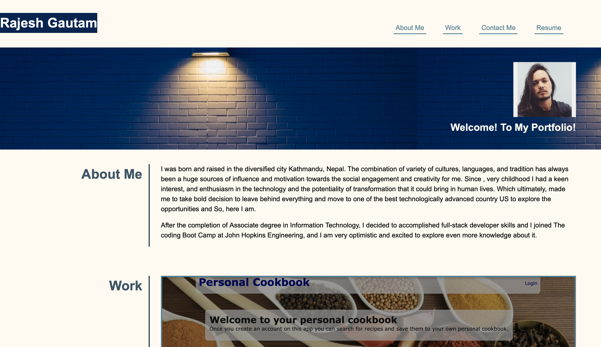

# Portfolio

### Description:

It is an simple portofolio application. It provides details about personnel information.  This app will run in the browser and feature dynamically with updated [HTML](https://developer.mozilla.org/en-US/docs/Web/HTML), and [CSS](https://developer.mozilla.org/en-US/docs/Web/CSS)

## Feature:

 For the conveninet, and best visual experinece, it has made simple, responsive, and colorful with appropriate css style 
 

## Screenshot:
Here is quick glimpse

   
    

## Links :

* Link for the deployed application [Updated-portfolio-02](https://github.com/tharveyster/recipe-search/tree/Razz)
* Link for the Github repository [Host by Heroku](https://tranquil-springs-98499.herokuapp.com)

## Contributor:

* [Rajesh Gautam](https://github.com/Rajesh295-dev)

- - -
